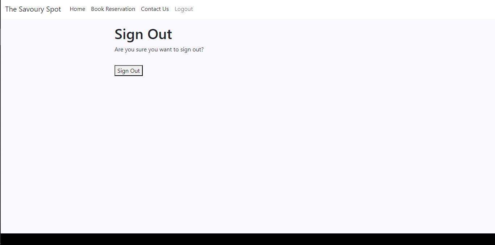

# THE SAVORY SPOT

The Savory Spot is a website for a fictional restaurant. Users can view the menu to see what’s available and can book reservations once logged in.

# UX

The aim of the website is to create a seamless experience where it is easy for the users log in, view the menu, book reservations and overall have an enjoyable time.

# User Stories

"As a ___ I can ____ so that I can ___"

As a customer I can enter reservation details so that I can show up at the given time and have a table ready ✅ 

As a customer I can view the menu so that I can decide what I want to order ✅ 

As a customer I can create an account so that I can book reservations ✅ 

As a customer I can email the restaurant so that I can leave a review or inquire about the menu ✅ 

As a customer I can search for specific items in the menu so that I can see if what I want is available ✅ 

As a user I can edit my reservations so that I change them to better suit my schedule ✅ 

As a user I can delete my reservations so that I don't stop the restaurant from taking other bookings ✅ 

# Features 

The menu can be viewed in sections by clicking on individual buttons that represent different categories. 

The menu can also be searched and will display any meals on offer that match the request.

Users can sign up to create their own account and sign back in later. 

Users can log out of their existing account.

Users can create, read, update, and delete their own reservations.

Users can contact the restaurant by sending an email on the contact page.

The admin can log in and change the available items on the menu as well as manage users and reservations.

# Future Features

In the future I would like to add the ability for customers to leave reviews on the site for others to view

## Tools & Technologies Used

- [HTML](https://en.wikipedia.org/wiki/HTML) used to display the information and images.
- [CSS](https://en.wikipedia.org/wiki/CSS) used to style the page and change the design.
- [CSS Flexbox](https://www.w3schools.com/css/css3_flexbox.asp) is used to easily control the layout of the page.
- [JavaScript](https://en.wikipedia.org/wiki/JavaScript) used to add interactivity to the page.
- [Git](https://git-scm.com) used for version control. (`git add`, `git commit`, `git push`)
- [GitHub](https://github.com) used to store the code.
- [GitHub Pages](https://pages.github.com) used for hosting the site.
- [Gitpod](https://gitpod.io) is used as a cloud-based IDE for development.
- [Visual Studio Code](https://code.visualstudio.com/) used as a source-code editor for development.
- [Django](https://en.wikipedia.org/wiki/Django_(web_framework)) used to create a database.
- [jQuery](https://en.wikipedia.org/wiki/JQuery) used to manipulate the DOM
- [Heroku](https://en.wikipedia.org/wiki/Heroku) used to deploy the app

## Testing

For all testing, please refer to the [TESTING.md](TESTING.md) file.

## Deployment

The live deployed application can be found deployed on [Heroku](https://the-savory-spot-36498e48077c.herokuapp.com/).

### Heroku Deployment

This project uses [Heroku](https://www.heroku.com), a platform as a service (PaaS) that enables developers to build, run, and operate applications entirely in the cloud.

Deployment steps are as follows, after account setup:

- Select **New** in the top-right corner of your Heroku Dashboard, and select **Create new app** from the dropdown menu.
- Your app name must be unique, and then choose a region closest to you (EU or USA), and finally, select **Create App**.
- From the new app **Settings**, click **Reveal Config Vars**, and set the value of KEY to `PORT`, and the value to `8000` then select *add*.#
`All Config Vars`:
- `SECRET_KEY`: your own secret key 
- `HEROKU_POSTGRESQL_SILVER_URL`: your URL
- `DATABASE_URL`: your URL
- `CLOUDINARY_URL`: your URL
- `email_password`: your password
- `email_sender`: your email

- If using any confidential credentials, such as CREDS.JSON, then these should be pasted in the Config Variables as well.
- Further down, to support dependencies, select **Add Buildpack**.
- The order of the buildpacks is important, select `Python` first, then `Node.js` second. (if they are not in this order, you can drag them to rearrange them)

Heroku needs two additional files in order to deploy properly.
- requirements.txt
- Procfile

You can install this project's **requirements** (where applicable) using:
- `pip3 install -r requirements.txt`

If you have your own packages that have been installed, then the requirements file needs updated using:
- `pip3 freeze --local > requirements.txt`

The **Procfile** can be created with the following command:
- `echo web: node index.js > Procfile`

For Heroku deployment, follow these steps to connect your own GitHub repository to the newly created app:

Either:
- Select **Automatic Deployment** from the Heroku app.

Or:
- In the Terminal/CLI, connect to Heroku using this command: `heroku login -i`
- Set the remote for Heroku: `heroku git:remote -a app_name` (replace *app_name* with your app name)
- After performing the standard Git `add`, `commit`, and `push` to GitHub, you can now type:
	- `git push heroku main`

The frontend terminal should now be connected and deployed to Heroku!

### Local Deployment

This project can be cloned or forked in order to make a local copy on your own system.

For either method, you will need to install any applicable packages found within the *requirements.txt* file.
- `pip3 install -r requirements.txt`.

#### Cloning

You can clone the repository by following these steps:

1. Go to the [GitHub repository](https://github.com/Briant-20/The-Savory-Spot) 
2. Locate the Code button above the list of files and click it 
3. Select if you prefer to clone using HTTPS, SSH, or GitHub CLI and click the copy button to copy the URL to your clipboard
4. Open Git Bash or Terminal
5. Change the current working directory to the one where you want the cloned directory
6. In your IDE Terminal, type the following command to clone my repository:
	- `git clone https://github.com/Briant-20/The-Savory-Spot.git`
7. Press Enter to create your local clone.

Alternatively, if using Gitpod, you can click below to create your own workspace using this repository.

Please note that in order to directly open the project in Gitpod, you need to have the browser extension installed.
A tutorial on how to do that can be found [here](https://www.gitpod.io/docs/configure/user-settings/browser-extension).

#### Forking

By forking the GitHub Repository, we make a copy of the original repository on our GitHub account to view and/or make changes without affecting the original owner's repository.
You can fork this repository by using the following steps:

1. Log in to GitHub and locate the [GitHub Repository](https://github.com/Briant-20/The-Savory-Spot)
2. At the top of the Repository (not top of page) just above the "Settings" Button on the menu, locate the "Fork" Button.
3. Once clicked, you should now have a copy of the original repository in your own GitHub account!

### Content

| Source | Location | Notes |
| --- | --- | --- |
| [Markdown Builder](https://traveltimn.github.io/markdown-builder) | README and TESTING | tool to help generate the Markdown files |

### Acknowledgements

- I would like to thank my Code Institute mentor, [Aleksei Konovalov](https://code-institute-room.slack.com/team/U029X3N2WN9) for his support throughout the development of this project.