# Testing

Return back to the [README.md](README.md) file.

## Code Validation

## Python

I have used the recommended [PEP8 CI Python Linter](https://pep8ci.herokuapp.com) to validate all of my Python files.
### Contact
| File | CI URL | Screenshot | Notes |
| --- | --- | --- | --- |
| views.py | [PEP8 CI](https://pep8ci.herokuapp.com/https://raw.githubusercontent.com/Briant-20/The-Savory-Spot/main/contact/views.py) | 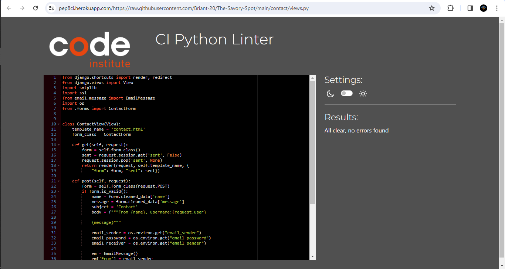 | All clear, no errors found |
| urls.py | [PEP8 CI](https://pep8ci.herokuapp.com/https://raw.githubusercontent.com/Briant-20/The-Savory-Spot/main/contact/urls.py) | 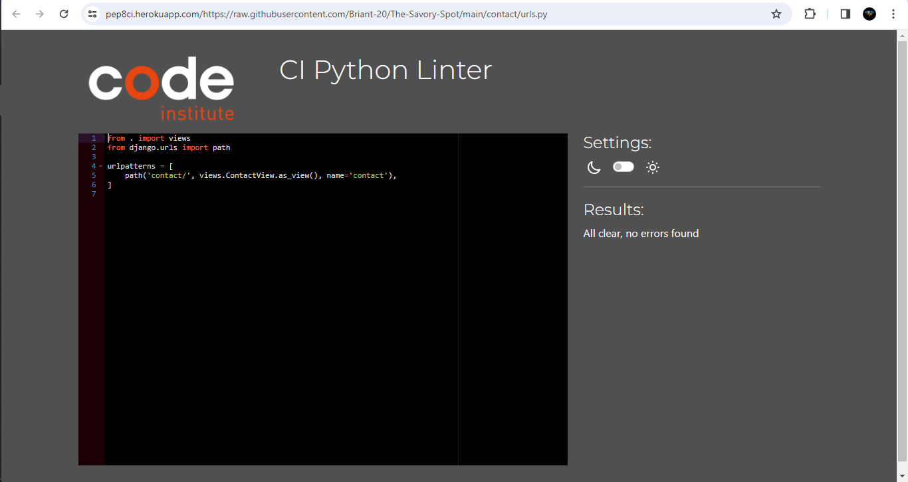 | All clear, no errors found |
| forms.py | [PEP8 CI](https://pep8ci.herokuapp.com/https://raw.githubusercontent.com/Briant-20/The-Savory-Spot/main/contact/forms.py) | 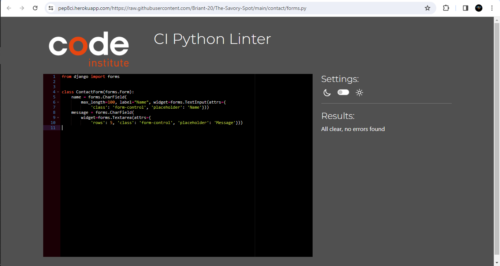 | All clear, no errors found |
| apps.py | [PEP8 CI](https://pep8ci.herokuapp.com/https://raw.githubusercontent.com/Briant-20/The-Savory-Spot/main/contact/apps.py) | 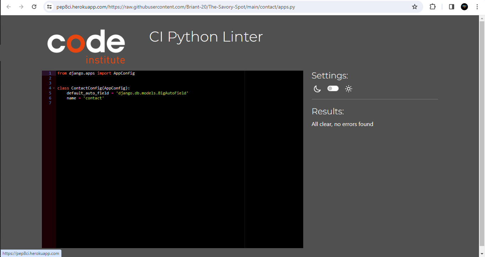 | All clear, no errors found |
| test_views.py | [PEP8 CI](https://pep8ci.herokuapp.com/https://raw.githubusercontent.com/Briant-20/The-Savory-Spot/main/contact/test_views.py) | 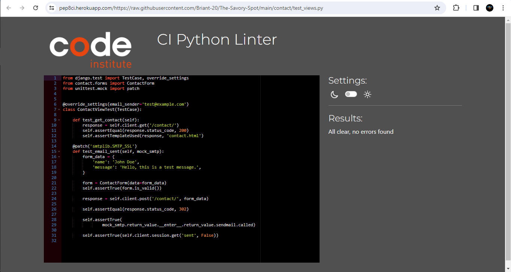 | All clear, no errors found |
| test_forms.py | [PEP8 CI](https://pep8ci.herokuapp.com/https://raw.githubusercontent.com/Briant-20/The-Savory-Spot/main/contact/test_forms.py) | 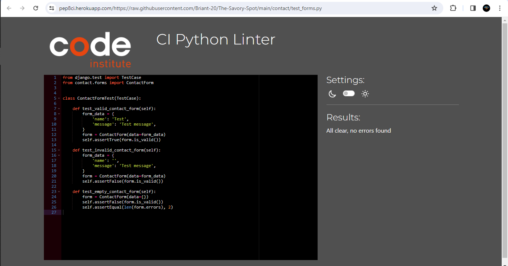 | All clear, no errors found |

### Menu
| File | CI URL | Screenshot | Notes |
| --- | --- | --- | --- |
| admin.py | [PEP8 CI](https://pep8ci.herokuapp.com/https://raw.githubusercontent.com/Briant-20/The-Savory-Spot/main/menu/admin.py) | 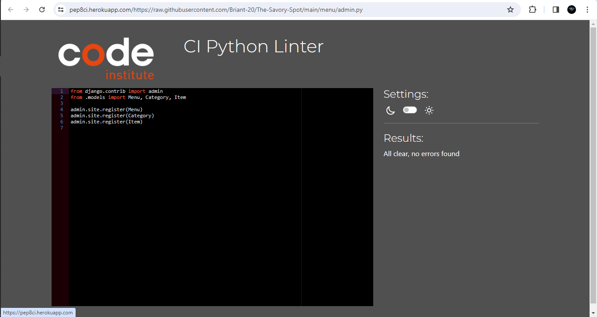 | All clear, no errors found |
| apps.py | [PEP8 CI](https://pep8ci.herokuapp.com/https://raw.githubusercontent.com/Briant-20/The-Savory-Spot/main/menu/apps.py) | 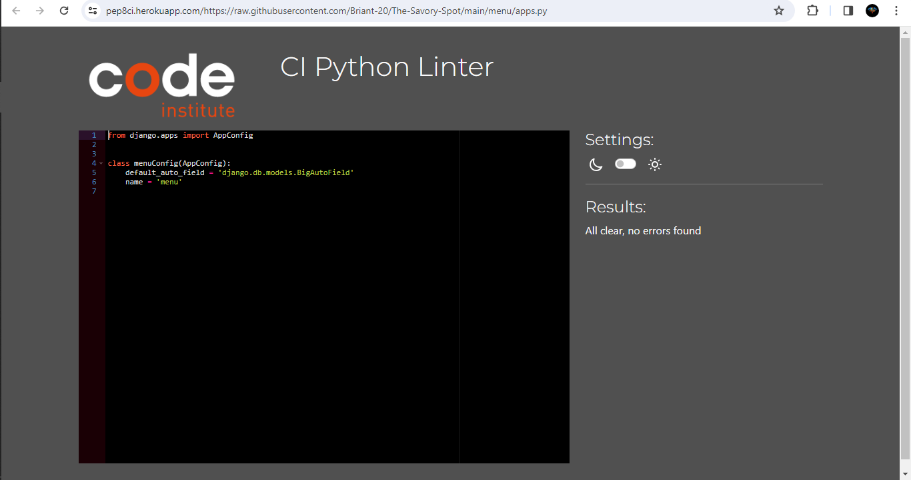 | All clear, no errors found |
| models.py | [PEP8 CI](https://pep8ci.herokuapp.com/https://raw.githubusercontent.com/Briant-20/The-Savory-Spot/main/menu/models.py) | 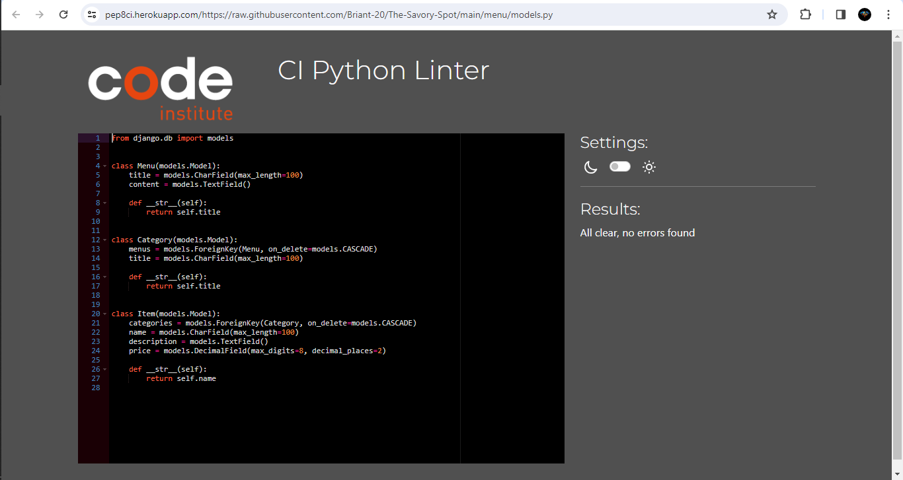 | All clear, no errors found |
| test_models.py | [PEP8 CI](https://pep8ci.herokuapp.com/https://raw.githubusercontent.com/Briant-20/The-Savory-Spot/main/menu/test_models.py) | 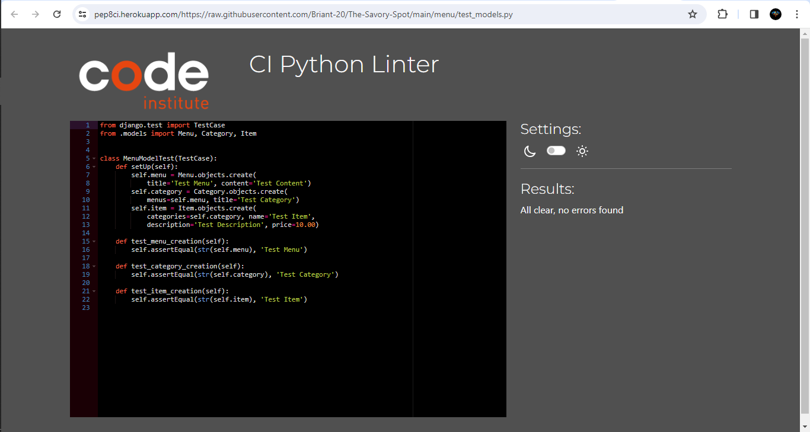 | All clear, no errors found |
| test_views.py | [PEP8 CI](https://pep8ci.herokuapp.com/https://raw.githubusercontent.com/Briant-20/The-Savory-Spot/main/menu/test_views.py) |  | All clear, no errors found |
| urls.py | [PEP8 CI](https://pep8ci.herokuapp.com/https://raw.githubusercontent.com/Briant-20/The-Savory-Spot/main/menu/urls.py) | 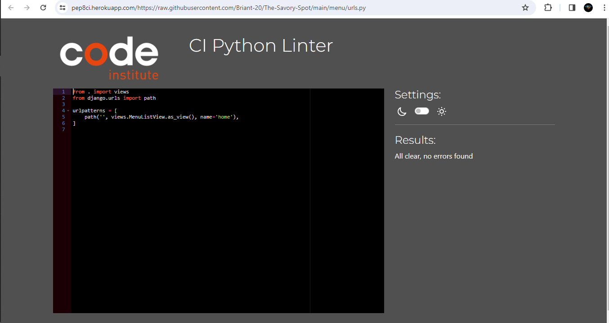 | All clear, no errors found |
| views.py | [PEP8 CI](https://pep8ci.herokuapp.com/https://raw.githubusercontent.com/Briant-20/The-Savory-Spot/main/menu/views.py) | 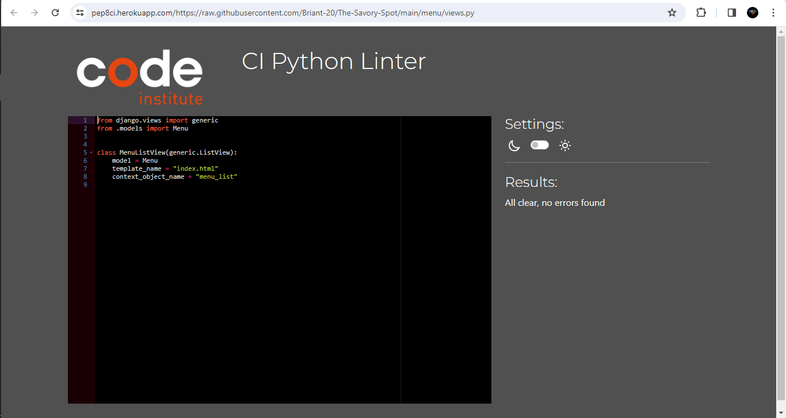 | All clear, no errors found |

### Reservation
| File | CI URL | Screenshot | Notes |
| --- | --- | --- | --- |
| admin.py | [PEP8 CI](https://pep8ci.herokuapp.com/https://raw.githubusercontent.com/Briant-20/The-Savory-Spot/main/reservation/admin.py) | 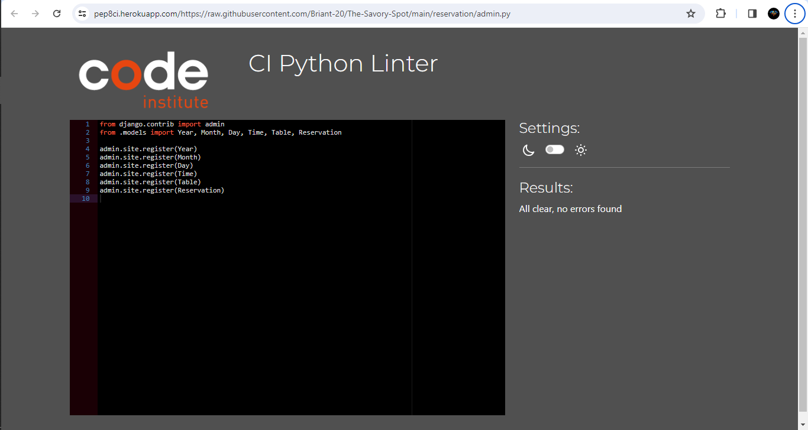 | All clear, no errors found |
| apps.py | [PEP8 CI](https://pep8ci.herokuapp.com/https://raw.githubusercontent.com/Briant-20/The-Savory-Spot/main/reservation/apps.py) | 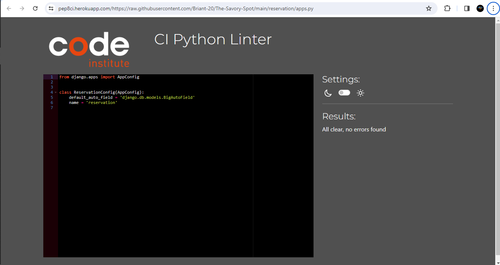 | All clear, no errors found |
| models.py | [PEP8 CI](https://pep8ci.herokuapp.com/https://raw.githubusercontent.com/Briant-20/The-Savory-Spot/main/reservation/models.py) | 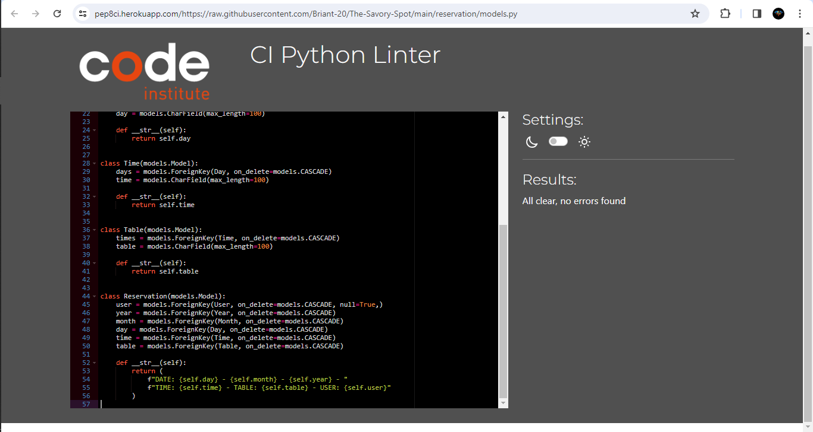 | All clear, no errors found |
| test_models.py | [PEP8 CI](https://pep8ci.herokuapp.com/https://raw.githubusercontent.com/Briant-20/The-Savory-Spot/main/reservation/test_models.py) | 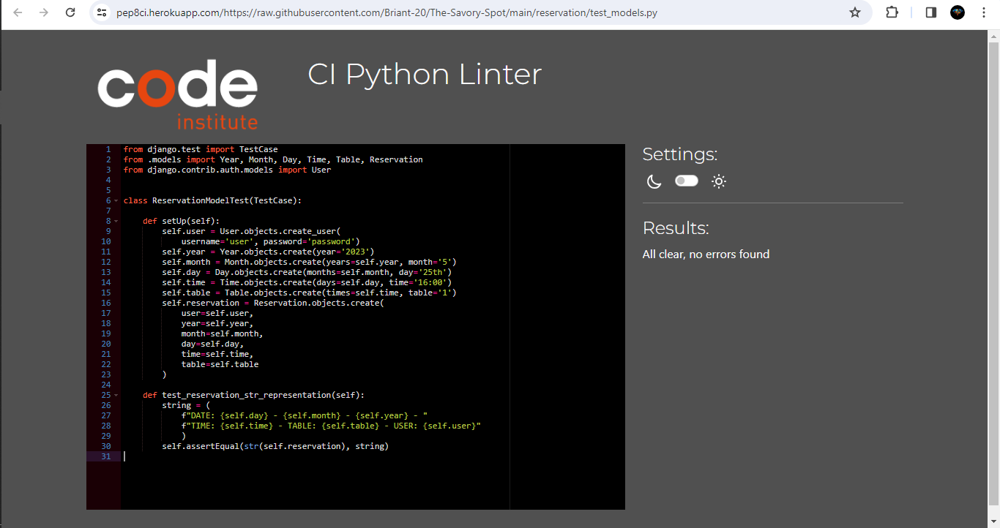 | All clear, no errors found |
| test_views.py | [PEP8 CI](https://pep8ci.herokuapp.com/https://raw.githubusercontent.com/Briant-20/The-Savory-Spot/main/reservation/test_views.py) | 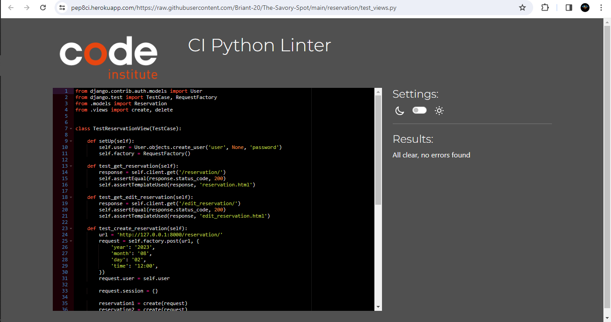 | All clear, no errors found |
| urls.py | [PEP8 CI](https://pep8ci.herokuapp.com/https://raw.githubusercontent.com/Briant-20/The-Savory-Spot/main/reservation/urls.py) | 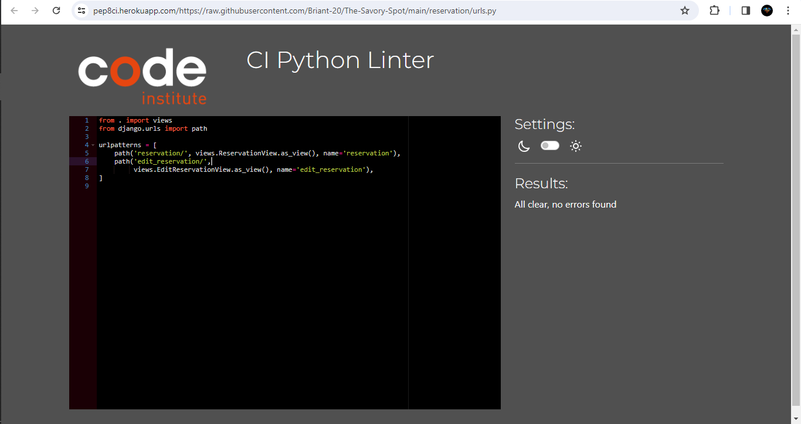 | All clear, no errors found |
| urls.py | [PEP8 CI](https://pep8ci.herokuapp.com/https://raw.githubusercontent.com/Briant-20/The-Savory-Spot/main/reservation/urls.py) |  | All clear, no errors found |
| views.py | [PEP8 CI](https://pep8ci.herokuapp.com/https://raw.githubusercontent.com/Briant-20/The-Savory-Spot/main/reservation/views.py) | 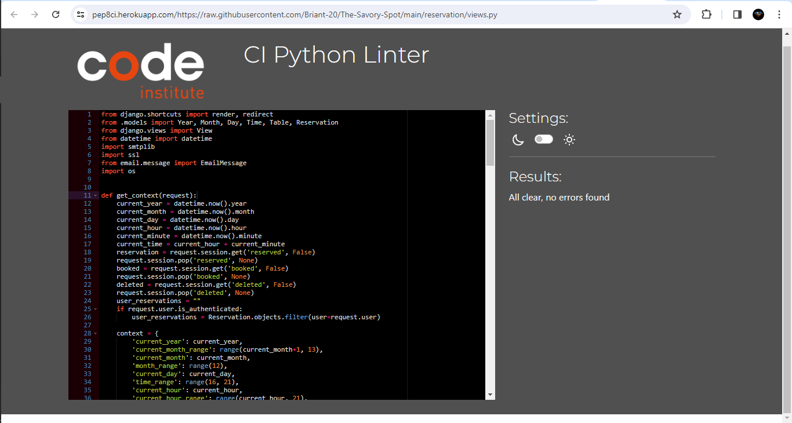 | All clear, no errors found |

## HTML
| File | CI URL | Screenshot | Notes |
| --- | --- | --- | --- |
| index.html | [W3C](https://validator.w3.org/nu/?showsource=yes&doc=https%3A%2F%2Fthe-savory-spot-36498e48077c.herokuapp.com%2F) | 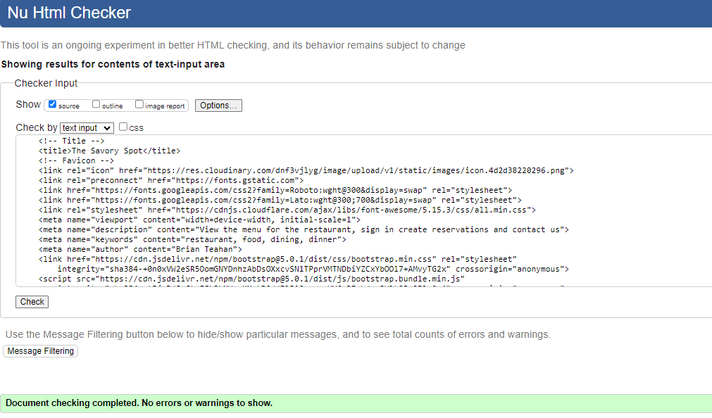 | All clear, no errors found |
| reservation.html | [W3C](https://validator.w3.org/nu/?showsource=yes&doc=https%3A%2F%2Fthe-savory-spot-36498e48077c.herokuapp.com%2Freservation%2F) | 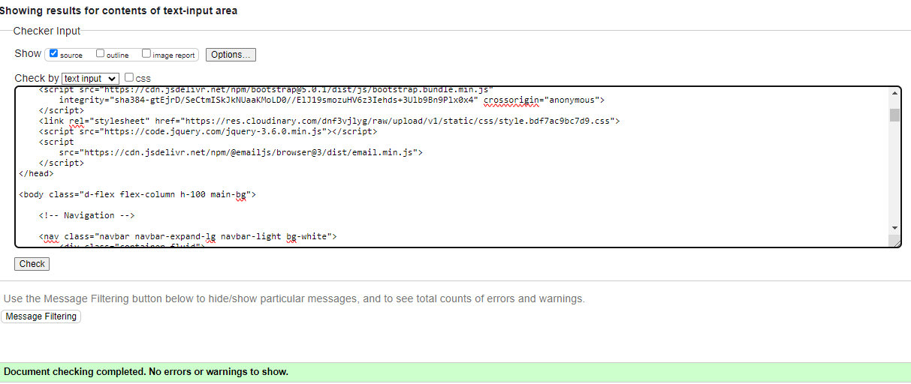 | All clear, no errors found |
| contact.html | [W3C](https://validator.w3.org/nu/?showsource=yes&doc=https%3A%2F%2Fthe-savory-spot-36498e48077c.herokuapp.com%2Fcontact%2F) | 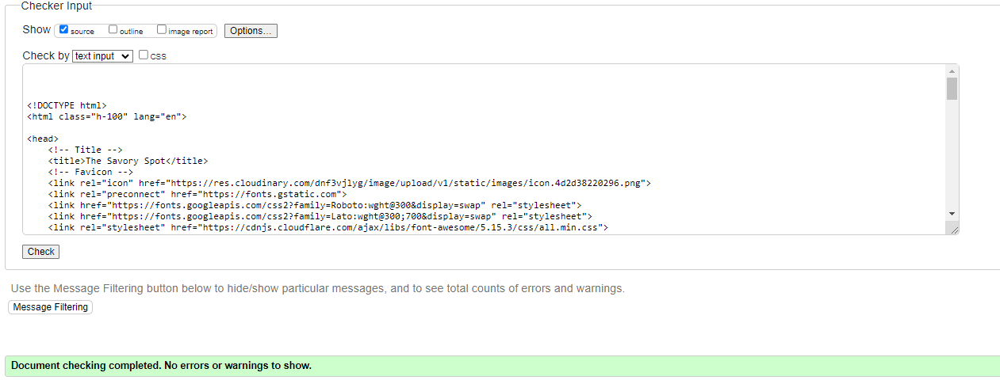 | All clear, no errors found |
| edit_reservation.html | [W3C](https://validator.w3.org/nu/?showsource=yes&doc=https%3A%2F%2Fthe-savory-spot-36498e48077c.herokuapp.com%2Fedit_reservation%2F) | 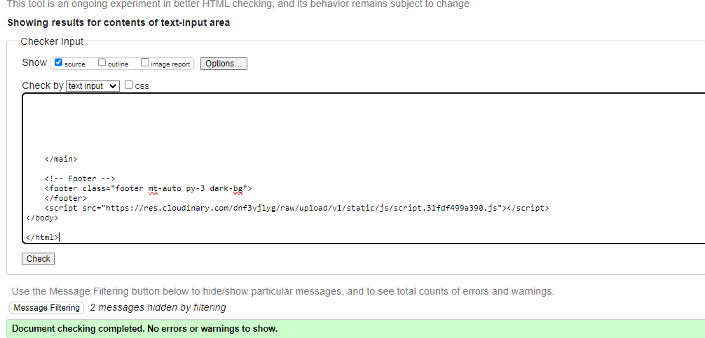 | All clear, no errors found |

## Javascript
| File | CI URL | Screenshot | Notes |
| --- | --- | --- | --- |
| script.js | [jshint](https://jshint.com/) | 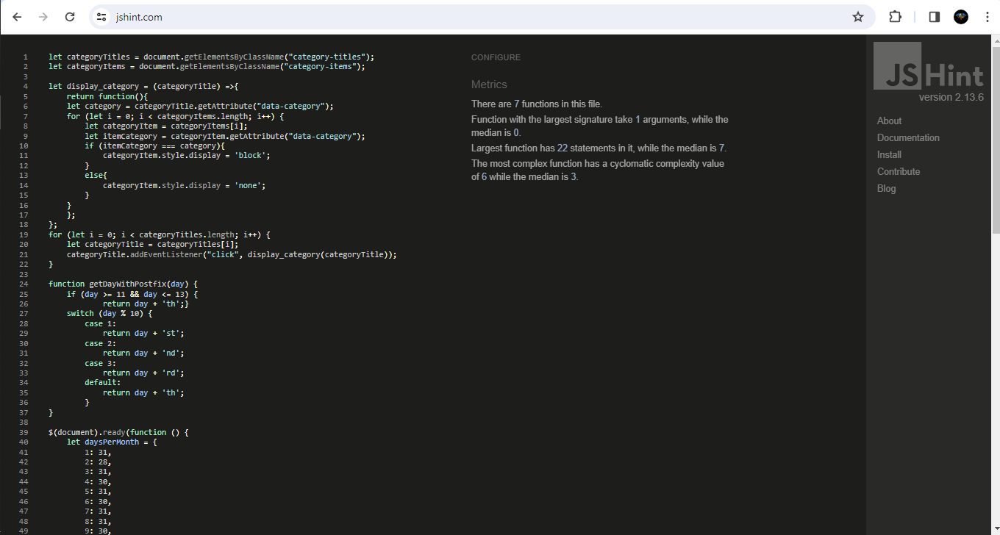 | All clear, no errors found |
| index.html | [jshint](https://jshint.com/) | 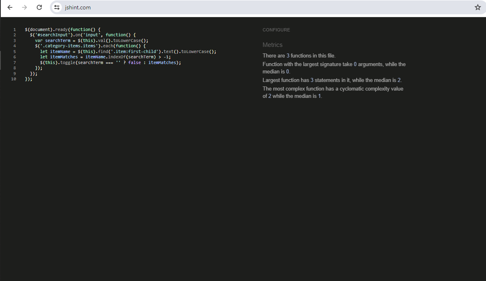 | All clear, no errors found |

## CCS 
| File | CI URL | Screenshot | Notes |
| --- | --- | --- | --- |
| style.css | [W3C](https://jigsaw.w3.org/css-validator/validator?uri=https%3A%2F%2Fthe-savory-spot-36498e48077c.herokuapp.com%2F&profile=css3svg&usermedium=all&warning=1&vextwarning=&lang=en) | 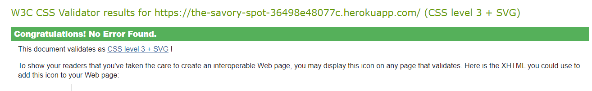 | All clear, no errors found |

## Python Testing

### Coverage Report

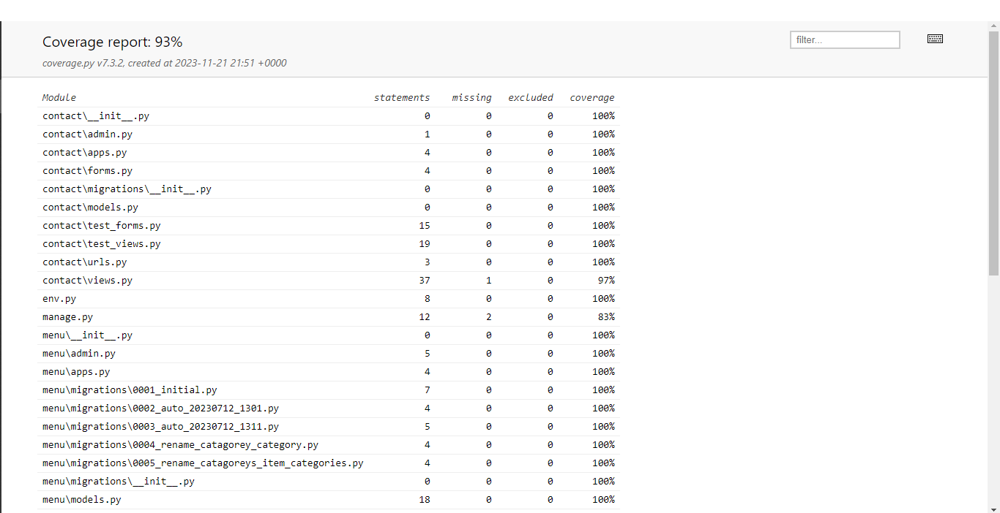

## Browser Compatibility

| Browser | Screenshot | Notes |
| --- | --- | --- |
| Chrome |  | Works as expected |
| Firefox | 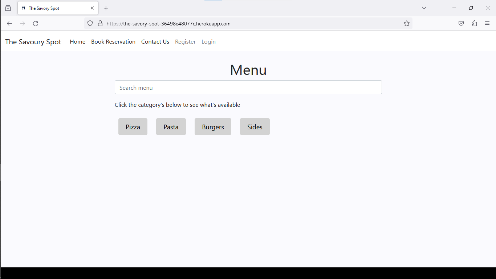 | Works as expected |
| Edge | 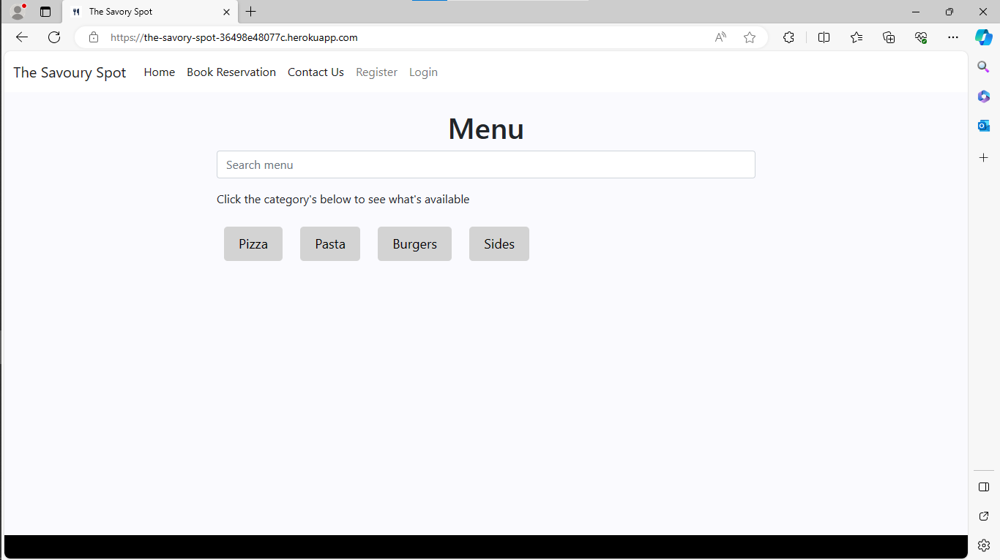 | Works as expected |