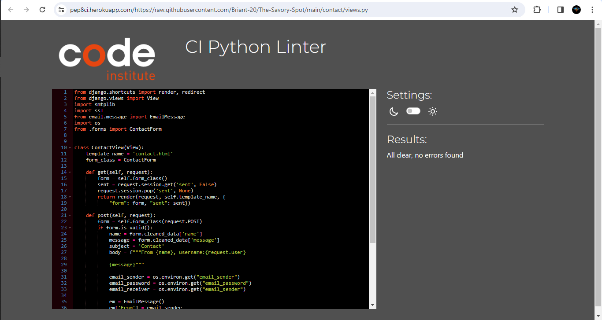
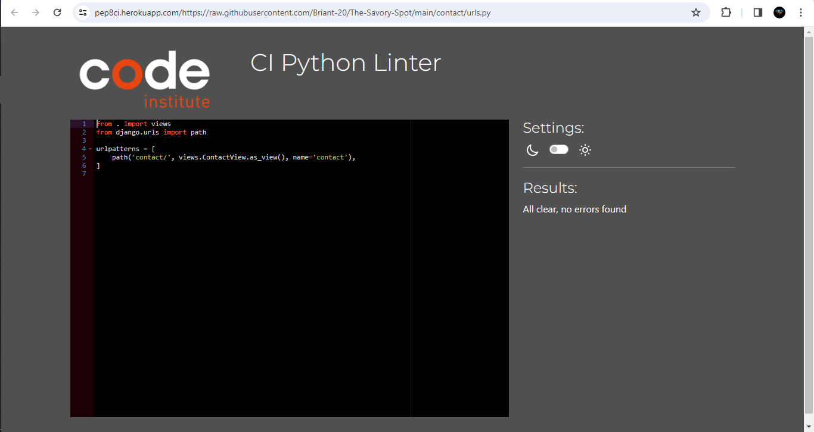

# Testing

Return back to the [README.md](README.md) file.

## Code Validation

## Python

I have used the recommended [PEP8 CI Python Linter](https://pep8ci.herokuapp.com) to validate all of my Python files.

| File | CI URL | Screenshot | Notes |
| --- | --- | --- | --- |
| views.py | [PEP8 CI](https://pep8ci.herokuapp.com/https://raw.githubusercontent.com/Briant-20/The-Savory-Spot/main/contact/views.py) |  | All clear, no errors found |
| urls.py | [PEP8 CI](https://pep8ci.herokuapp.com/https://raw.githubusercontent.com/Briant-20/The-Savory-Spot/main/contact/urls.py) |  | All clear, no errors found |
