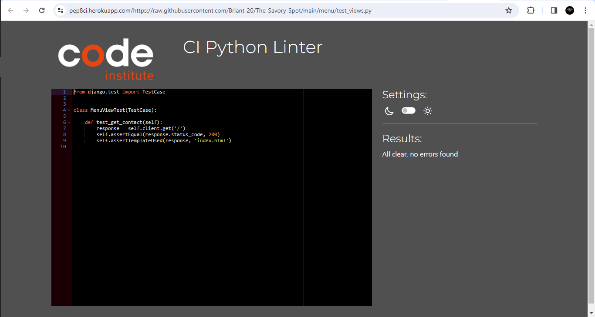

# Testing

Return back to the [README.md](README.md) file.

## Code Validation

## Python

I have used the recommended [PEP8 CI Python Linter](https://pep8ci.herokuapp.com) to validate all of my Python files.

| File | CI URL | Screenshot | Notes |
| --- | --- | --- | --- |
# Contact
| views.py | [PEP8 CI](https://pep8ci.herokuapp.com/https://raw.githubusercontent.com/Briant-20/The-Savory-Spot/main/contact/views.py) |  | All clear, no errors found |

| urls.py | [PEP8 CI](https://pep8ci.herokuapp.com/https://raw.githubusercontent.com/Briant-20/The-Savory-Spot/main/contact/urls.py) |  | All clear, no errors found |

| forms.py | [PEP8 CI](https://pep8ci.herokuapp.com/https://raw.githubusercontent.com/Briant-20/The-Savory-Spot/main/contact/forms.py) |  | All clear, no errors found |

| apps.py | [PEP8 CI](https://pep8ci.herokuapp.com/https://raw.githubusercontent.com/Briant-20/The-Savory-Spot/main/contact/apps.py) |  | All clear, no errors found |

| test_views.py | [PEP8 CI](https://pep8ci.herokuapp.com/https://raw.githubusercontent.com/Briant-20/The-Savory-Spot/main/contact/test_views.py) |  | All clear, no errors found |

| test_forms.py | [PEP8 CI](https://pep8ci.herokuapp.com/https://raw.githubusercontent.com/Briant-20/The-Savory-Spot/main/contact/test_forms.py) |  | All clear, no errors found |

# Menu
| admin.py | [PEP8 CI](https://pep8ci.herokuapp.com/https://raw.githubusercontent.com/Briant-20/The-Savory-Spot/main/menu/admin.py) |  | All clear, no errors found |

| apps.py | [PEP8 CI](https://pep8ci.herokuapp.com/https://raw.githubusercontent.com/Briant-20/The-Savory-Spot/main/menu/apps.py) |  | All clear, no errors found |

| models.py | [PEP8 CI](https://pep8ci.herokuapp.com/https://raw.githubusercontent.com/Briant-20/The-Savory-Spot/main/menu/models.py) |  | All clear, no errors found |

| test_models.py | [PEP8 CI](https://pep8ci.herokuapp.com/https://raw.githubusercontent.com/Briant-20/The-Savory-Spot/main/menu/test_models.py) |  | All clear, no errors found |

| test_views.py | [PEP8 CI](https://pep8ci.herokuapp.com/https://raw.githubusercontent.com/Briant-20/The-Savory-Spot/main/menu/test_views.py) |  | All clear, no errors found |

| urls.py | [PEP8 CI](https://pep8ci.herokuapp.com/https://raw.githubusercontent.com/Briant-20/The-Savory-Spot/main/menu/urls.py) |  | All clear, no errors found |

| views.py | [PEP8 CI](https://pep8ci.herokuapp.com/https://raw.githubusercontent.com/Briant-20/The-Savory-Spot/main/menu/views.py) |  | All clear, no errors found |

# Reservation
| admin.py | [PEP8 CI](https://pep8ci.herokuapp.com/https://raw.githubusercontent.com/Briant-20/The-Savory-Spot/main/reservation/admin.py) |  | All clear, no errors found |

| apps.py | [PEP8 CI](https://pep8ci.herokuapp.com/https://raw.githubusercontent.com/Briant-20/The-Savory-Spot/main/reservation/apps.py) |  | All clear, no errors found |

| models.py | [PEP8 CI](https://pep8ci.herokuapp.com/https://raw.githubusercontent.com/Briant-20/The-Savory-Spot/main/reservation/models.py) |  | All clear, no errors found |

| test_models.py | [PEP8 CI](https://pep8ci.herokuapp.com/https://raw.githubusercontent.com/Briant-20/The-Savory-Spot/main/reservation/test_models.py) |  | All clear, no errors found |

| test_views.py | [PEP8 CI](https://pep8ci.herokuapp.com/https://raw.githubusercontent.com/Briant-20/The-Savory-Spot/main/reservation/test_views.py) |  | All clear, no errors found |

| urls.py | [PEP8 CI](https://pep8ci.herokuapp.com/https://raw.githubusercontent.com/Briant-20/The-Savory-Spot/main/reservation/urls.py) |  | All clear, no errors found |

| urls.py | [PEP8 CI](https://pep8ci.herokuapp.com/https://raw.githubusercontent.com/Briant-20/The-Savory-Spot/main/reservation/urls.py) |  | All clear, no errors found |

| views.py | [PEP8 CI](https://pep8ci.herokuapp.com/https://raw.githubusercontent.com/Briant-20/The-Savory-Spot/main/reservation/views.py) |  | All clear, no errors found |